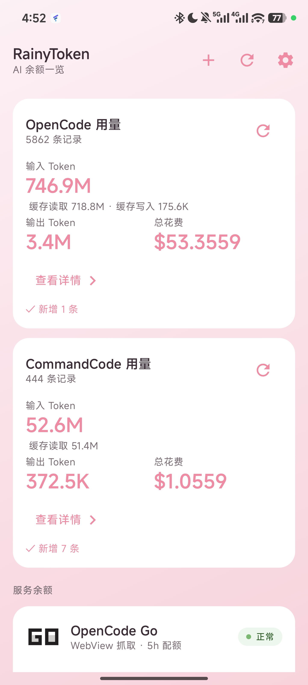
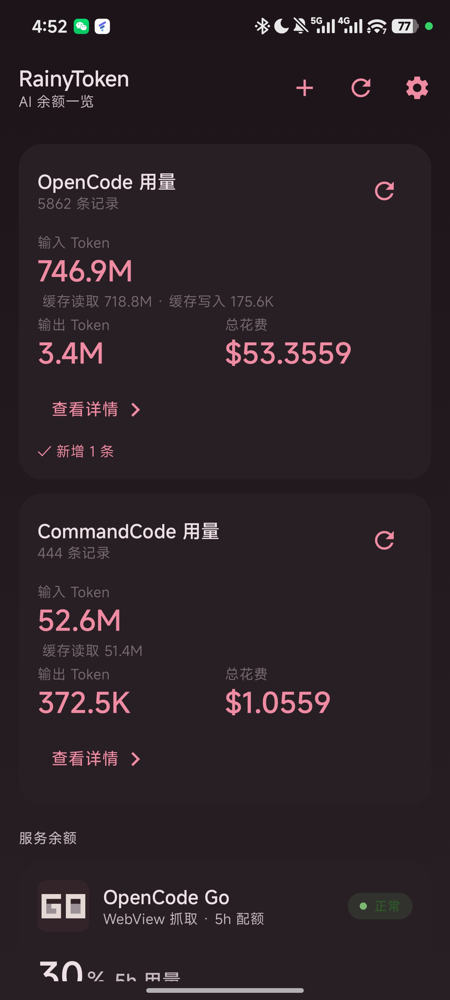
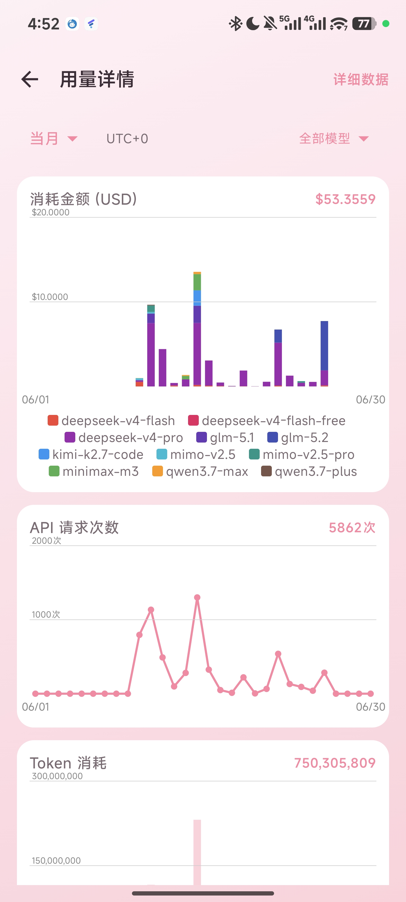
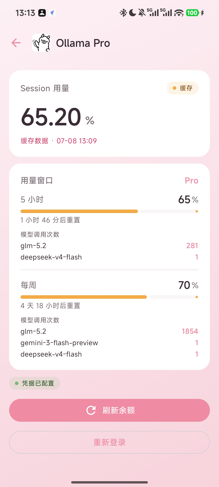
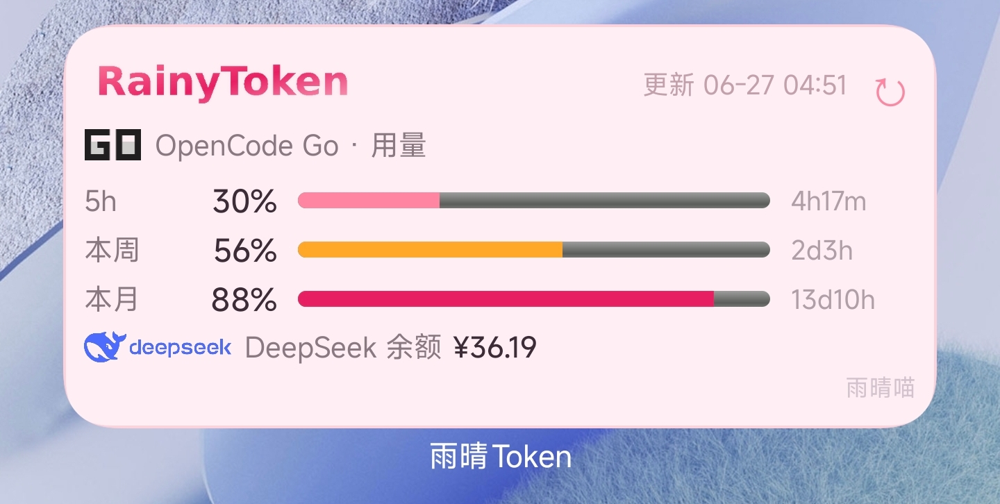
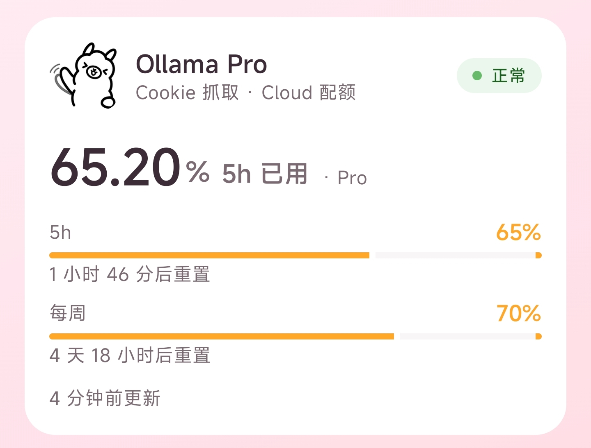

# 🌧️ 雨晴Token (RainyToken)

> *"AI 用量，尽在掌握 — AI Balance & Usage at a Glance"* 🐱✨

[](https://github.com/CATMIAOZHI/Rainytoken/actions)
[](https://github.com/CATMIAOZHI/Rainytoken/releases)
Android AI 余额与用量查询 APP —— 统一查看 DeepSeek、OpenCode Go、CommandCode Go、Codex / ChatGPT Plus、Ollama Pro 的余额与用量配额。粉色调品牌 UI，配套桌面小组件。
🐱 雨晴Token — AI Balance & Usage Quota Query | the Rainy Family tools.

---

## 📸 截图

<p align="center">
  
  
  
  
</p>

<p align="center">
  <em>仪表盘（亮色） · 仪表盘（深色） · 用量图表 · Ollama Pro 模型调用次数</em>
</p>

<p align="center">
  
  
</p>

<p align="center">
  <em>桌面小组件 · Ollama Pro 首页卡片</em>
</p>

---

## ✨ 功能特性

| 特性 | 说明 |
|------|------|
| 📊 **仪表盘** | DeepSeek 余额（¥）+ 各服务用量/余额卡片；OCGO/CCGO 卡片可直达用量详情；长按拖动自由排序（持久化）；下拉全局刷新 · 平板自适应双窗格布局 |
| 📈 **用量图表** | 3 张 Canvas 手绘图表 — 消耗金额 / API 请求次数 / Token 消耗（OCGO & CCGO 双数据源）；支持 UTC+0/UTC+8 时区切换和自定义日/月/范围；自动降级（近5h无数据→12h→7天→当月）；平板并排展示 |
| 📱 **平板适配** | 全局 `BoxWithConstraints` 自适应容器宽度；≥600dp 卡片双列，≥700dp 图表并排；双窗格 35/65 左右分栏（Expanded 模式）；支持 Android 13+ 预见性返回手势 |
| 📋 **详细数据** | 原始记录分页浏览，支持时间 + 模型筛选，点击查看完整字段 |
| 🔍 **多粒度筛选** | 5小时 / 12小时(10分钟桶) / 24小时 / 今天 / 昨天 / 最近7天 / 当月 / 自定义日·月·范围 |
| 🏷️ **模型筛选** | 多选 / 单选 / 全选，动态图例自适应换行 |
| 📱 **桌面小组件** | 不打开 APP 也能看用量；支持四服务切换（OCGO/CCGO/Codex/Ollama）+ DeepSeek 余额；左上角 > 进 APP、其他区域点切换、↻ 刷新；可拖入负一屏；划到即自动刷新（MIUI 曝光刷新） |
| 🔄 **自动同步** | 首页下拉自动同步用量；无缓存时启动自动全量同步；CCGO 详情页支持手动清除并重新同步 |
| 🌙 **深色模式** | 全局自适应 — App 内文字/图标/背景自动切换，小组件独立适配暗色布局 |
| ➕ **一键添桌面** | APP 内点 + 直接添加小组件，不用去系统列表翻；二次确认 + 权限检测 |
| 💡 **使用小技巧** | 首页随机展示一条操作提示（每次启动刷新）；设置页可查看全部 13 条隐藏操作技巧 |
| ⚡ **Room 数据库** | 用量记录存 Room（indexed on workspaceId+timeCreated），DAO 查询替代全量 JSON 序列化；首次启动自动从旧 DataStore 迁移 |
| 🎀 **雨晴粉主题** | Material Design 3 · 草莓粉 #FF85A2 · 樱粉 #FFD1DC |
| 🔐 **Codex OAuth 登录** | 无头模式 OAuth PKCE：APP 生成授权链接 → 外部浏览器登录 → 粘贴回调 URL 完成授权，无需手动导出 auth.json |
| ⚡ **Codex 一键激活用量** | Codex 详情页可向 ChatGPT API 发送简短请求触发用量统计；模型列表从 models.dev 动态获取并持久化，支持手动刷新；响应弹窗可复制 |
| 🐛 **调试日志** | APP 内「调试日志」页面，查看 Repository 网络请求、Token 刷新、解析错误等详细日志，无需连接电脑 |

---

## 📦 下载

前往 [Releases](https://github.com/CATMIAOZHI/Rainytoken/releases) 下载最新 APK。

> ⚠️ 需要配置 DeepSeek API Key、OpenCode Go 登录凭据、CommandCode Go API Key、Codex（OAuth 登录或粘贴 auth.json）或 Ollama Pro Cookie 才能拉取数据。

---

## 🏗️ 技术架构

```
┌──────────────────────────────────────────────────┐
│                 Android App                       │
│                                                   │
│  ┌─────────────────────────────────────────────┐ │
│  │        Compose UI（3 层页面）                │ │
│  │  仪表盘 · 用量图表 · 总统计 · 详细数据 · 设置│ │
│  └────────────────────┬────────────────────────┘ │
│                       │                           │
│  ┌────────────────────▼─────────────────────────┐ │
│  │         ViewModel 层（MVVM）                  │ │
│  │  DashboardVM · UsageVM · UsageChartVM        │ │
│  │  · UsageDataVM（Hilt 注入）                   │ │
│  └────────────────────┬────────────────────────┘ │
│                       │                           │
│  ┌────────────────────▼─────────────────────────┐ │
│  │         UseCase 层                            │ │
│  │  RefreshBalanceUseCase（余额）                │ │
│  │  SyncUsageUseCase / SyncCommandCodeUsageUseCase│ │
│  └────────────────────┬────────────────────────┘ │
│                       │                           │
│  ┌────────────────────▼─────────────────────────┐ │
│  │         Repository + Network                  │ │
│  │  DeepSeekApi（Retrofit）· OpenCodeGo 网页抓取
│  │  · OpenCodeUsageRepository · CommandCodeUsageRepository · CodexRepository · OllamaRepository（OkHttp）│ │
│  └────────────────────┬────────────────────────┘ │
│                       │                           │
│  ┌────────────────────▼─────────────────────────┐ │
│  │         本地存储                              │ │
│  │  BalanceCache（DataStore）                    │ │
│  │  UsageCache（Room，indexed on workspaceId+timeCreated） │ │
│  │  CredentialRepository（Keystore AES-256 GCM） │ │
│  └──────────────────────────────────────────────┘ │
└──────────────────────────────────────────────────┘
```

---

## 📁 项目结构

```
Rainytoken/
├── app/src/main/java/com/rainy/token/
│   ├── data/
│   │   ├── cache/          # BalanceCache（DataStore）
│   │   ├── local/          # UsageCache（Room）、UsageRecordEntity、UsageDao、UsageDatabase、ChartBucket
│   │   ├── remote/         # DeepSeekApi（Retrofit）+ OpenCodeGo 抓取 + UsageRepository
│   │   └── repository/     # DeepSeek / OpenCodeGo / CommandCode / Codex / Ollama / Credential Repository
│   ├── domain/
│   │   ├── model/          # ServiceBalance、Credential 等
│   │   ├── service/        # ServiceType 枚举
│   │   └── usecase/        # RefreshBalanceUseCase / SyncUsageUseCase / SyncCommandCodeUsageUseCase
│   ├── ui/
│   │   ├── dashboard/      # DashboardScreen / UsageDetailScreen / UsageOverviewScreen / UsageDataScreen
│   │   ├── widget/         # 桌面小组件（OpenCodeGoWidgetProvider）
│   │   ├── components/     # ServiceIcon / StatusChip 等
│   │   ├── theme/          # 雨晴粉主题（StrawberryPink / InkMuted）
│   │   └── RainyTokenNavHost.kt  # Navigation 路由
│   └── di/                 # Hilt 模块
├── gradle/libs.versions.toml   # Version Catalog 依赖管理
├── build.gradle.kts            # 项目级配置
└── settings.gradle.kts         # 项目设置
```

---

## 🛠️ 构建

### 方式一：Android Studio（推荐）
1. Clone 仓库：`git clone https://github.com/CATMIAOZHI/Rainytoken.git`
2. 用 Android Studio 打开项目
3. 同步 Gradle，连接设备，Run ▶️

### 方式二：命令行
```bash
# 构建 Debug APK
./gradlew assembleDebug
# APK 输出：app/build/outputs/apk/debug/app-debug.apk

# 构建 Release APK
./gradlew assembleRelease
```

<details>
<summary>🔧 ARM64 环境说明（非必需）</summary>

项目内置了 ARM64 AAPT2 二进制，在 Proot/Termux 等 ARM64 环境中自动启用：
```bash
chmod +x ./setup_android_env.sh
./setup_android_env.sh
```
该脚本会配置 `$ANDROID_HOME` 并使用项目内置的 ARM64 build-tools。

**Release 构建额外配置**：ARM64 Proot 下 AGP 9.0 的 `optimizeReleaseResources` 传入 `--resource-path-shortening-map=<path>` 等号参数，ARM64 AAPT2 不接受此语法，需在 `~/.gradle/gradle.properties`（全局，不提交项目仓库）中配置 AAPT2 wrapper：
```properties
android.aapt2FromMavenOverride=/path/to/android-aapt2-wrapper/aapt2
```
wrapper 脚本将等号形式拆分为空格分隔的两个独立 argv。项目 `build.gradle.kts` 中已内置 `guardReleaseResources` 任务作为构建防护（optimized `.ap_` 缺失时自动 fallback 到 linked `.ap_`）。
> 在 x86_64 环境（GitHub Actions / 普通 Linux）中会自动走官方 AAPT2，无需额外操作。
</details>

---

## 📦 依赖管理

项目使用 Gradle Version Catalog (`gradle/libs.versions.toml`) 统一管理依赖。

| 依赖 | 用途 |
|------|------|
| `androidx.compose:compose-bom` | Jetpack Compose BOM |
| `androidx.navigation:navigation-compose` | 页面导航 |
| `com.squareup.retrofit2:retrofit` | DeepSeek REST API |
| `com.squareup.okhttp3:okhttp` | OpenCode Go 网页抓取 |
| `org.jetbrains.kotlinx:kotlinx-serialization-json` | JSON 序列化 |
| `androidx.room:room-runtime` | 用量数据本地数据库（Room） |
| `androidx.datastore:datastore-preferences` | 本地缓存 |
| `com.google.dagger:hilt-android` | 依赖注入 |
| `com.google.devtools.ksp:symbol-processing-api` | KSP 注解处理 |

---

## 🔒 安全说明

- ✅ API Key / Session 凭据存入 **Android Keystore**（AES-256 GCM 加密）
- ✅ 网络请求仅向 DeepSeek / OpenCode 官方 API 发出
- ✅ `allowBackup=false`：凭据密文、用量数据均不参与系统备份，避免换机恢复后密文无法解密
- ✅ 签名密钥固定，每次 Release 可覆盖安装
- ✅ GitHub Secrets 加密存储签名密钥及密码，CI 中解码使用

---

## 🐱 关于

RainyToken（雨晴Token）是「雨晴系列」的第 4 个成员，由 [雨晴喵](https://github.com/CATMIAOZHI) 编纂，随 [雨晴系列](https://github.com/CATMIAOZHI?tab=repositories) 发布：

- [RainyLLM](https://github.com/CATMIAOZHI/RainyLLM) — 纯离线 Android 本地 LLM 推理服务器（Gemma + OpenAI 兼容 API）
- [RainyScanner](https://github.com/CATMIAOZHI/RainyScanner) — 不拦截不跳转的 Android 扫码工具
- [Rainy2FA](https://github.com/CATMIAOZHI/Rainy2FA) — 纯本地 · 零联网 · 生物识别保护的 TOTP 验证器
- **RainyToken** — AI 余额与用量查询 APP | AI Balance & Usage Quota Query（本项目）

> 🎀 Made with love by 雨晴喵 — 守护主人的每一分算力预算 💖

---

## 📄 License

MIT License © 2026 Rainy

---

<p align="center">💖 Made with love by 雨晴喵</p>